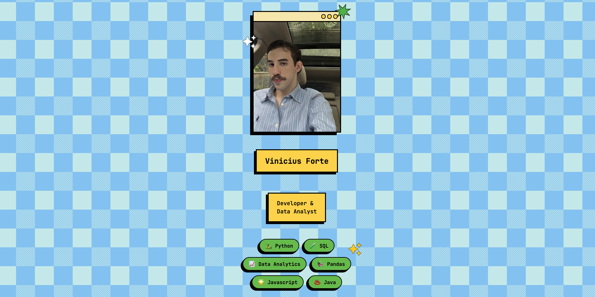

# 👨🏻‍💻 My Portfolio | Vinicius Forte

> *My personal landing page project*

🌐 Live Demo: [viniciusforte-mybio.vercel.app](https://viniciusforte-mybio.vercel.app/)


## 👋 About This Project

This is my personal presentation page, built from scratch using HTML, CSS, and JavaScript.

The design follows a **Neo-brutalist/Retro** aesthetic — a style characterized by bold borders, striking shadows, and vibrant colors that give the page a unique personality.



## 💭 Why a "Bio" page?

I decided to create a hub that connects all my information for anyone who wants to get in touch or learn more about my work. Initially, I thought about something simple like a Linktree, but I decided to challenge myself and build something more distinctive and customized.

---

## ✨ Features

### 🎨 Design

- Vibrant color palette
- Animated decorative elements (stars, sparkles, even a little coffee cup!)
- Hover effects on all clickable elements
- Hard-shadow depth effects
- Typography featuring JetBrains Mono


### 🎯 Technical Highlights

**🖱️ Dual Cursor**

I implemented a custom cursor that changes shape dynamically:

- **Default arrow** while navigating
- **Pointer (hand)** when hovering over clickable items

**✨ On-Scroll Animations**

Powered by the **Intersection Observer API** to animate elements as they enter the viewport:

- Sequential delay for card entry
- Opacity transitions and vertical movement
- Performance-optimized (Prevents excessive reflows and ensures 60 FPS animations)

**📦 Modal System**

Project cards open modals with detailed information. Features include:

- Entrance animation with rotation and scaling
- Backdrop blur to highlight the active modal
- Multiple ways to close (X button, clicking outside, or ESC key)
- Body scroll locking when the modal is open
- Dynamic content injection via JavaScript


**📊 Performance**

A major focus was kept on high performance:

- ⚡ Zero dependencies = ultra-lightweight bundle (~50KB total)
- 🎨 GPU-accelerated animations using `transform` and `opacity`
- 🖼️ Native lazy loading for images
- 📱 Mobile-first responsive design
- ⚙️ Optimized code without heavy loops or unnecessary re-renders

**📱 Mobile**

Fully responsive design for mobile devices:

- Adaptive layout that reorganizes elements for smaller screens
- Project grid collapses into a single column on mobile
- Custom cursor disabled for touch devices
- Interactions optimized for touch gestures
- Tested across various screen sizes

<p align="left">
  
  
  
</p>


## 🛠️ Technologies

- **HTML5** - Structure
- **CSS3** - Styling and all animations
- **JavaScript** - Interactivity and logic

### Why no frameworks?

I chose to keep it simple for study purposes, focusing on:

- Deep diving into DOM manipulation
- Creating high-performance animations
- Structuring clean and maintainable vanilla code
- Solving problems without relying on external libraries


## 📁 Structure

```
MyBio/
│
├── index.html         # Core structure
├── style.css          # Styles and animations
├── script.js          # Logic and interactivity
│
├── assets/            # Static files
│   ├──screenshots/    # Bio screenshots
│   ├── avatar.jpg     # Profile picture
│   ├── portfolio.png  # Card icons
│   ├── projeto.png
│   ├── perfil.png
│   └── contato.png
│
└── README.md          # You are here!
```

## 🚀 How to run the project

1. Clone the repository: `git clone https://github.com/vininoronha21/MyBio.git`
2. Open the `index.html` file in your browser.

> *(Tip: Use the **Live Server** extension in VS Code for the best experience)*


## 🎯 Next Steps

- [ ] Toggle light/dark theme
- [ ] Blog section to share my learning journey
- [ ] GitHub API integration to showcase repositories automatically
- [ ] Scaling to a landing page using modern frameworks (e.g., React)


## 📝 License

This project is under the MIT license. See the [LICENSE](LICENSE) file for more details.


## 👨‍💻 Author

Developed by **Vinícius Forte**

- 🐙 GitHub: [vininoronha21](https://github.com/vininoronha21)
- 💼 LinkedIn: [Vinícius Noronha](https://linkedin.com/in/viniciusnoronha)
- 📧 Email: contatovininoronha@gmail.com