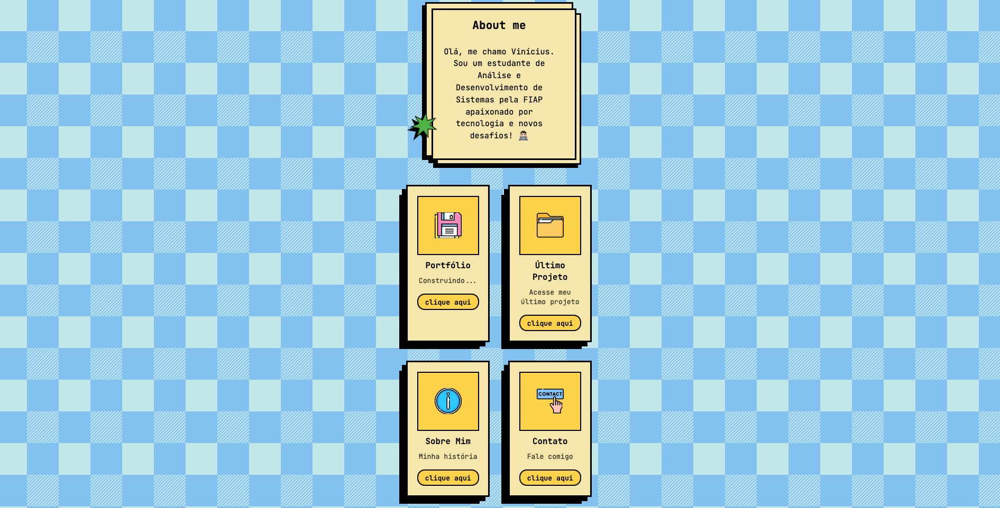
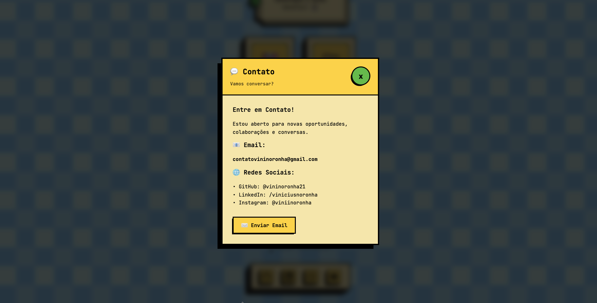
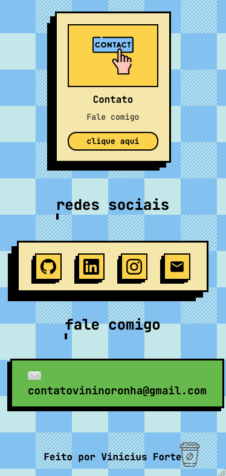
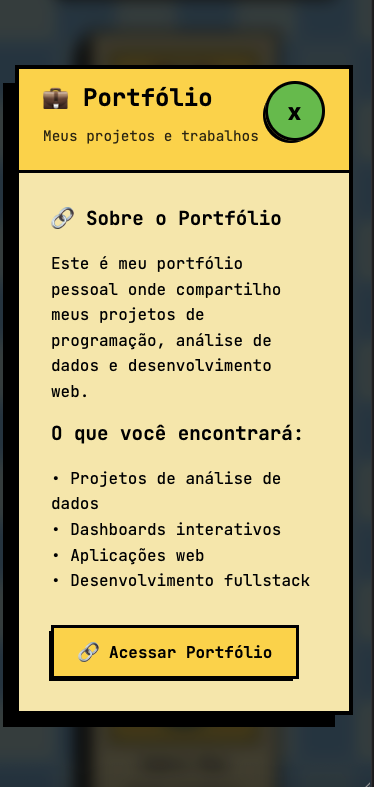
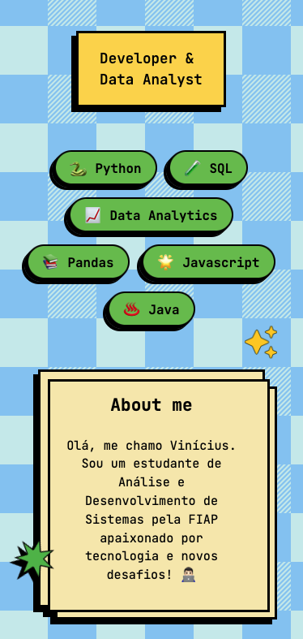

# 👨🏻‍💻 Meu Portfólio | Vinicius Forte

> *Projeto da minha página pessoal*

🌐 Acesse na Web: [link-vinicius.com](https://seu-link.com)


## 👋 Sobre Este Projeto

Essa é minha página de apresentação! Criei usando HTML, CSS e JavaScript.

O design segue a estética **neo-brutalista/retro** - aquele estilo com bordas fortes, sombras marcantes e cores vibrantes que fazem a página ter personalidade.

<p align="left">
  <video src="assets/screenshots/video.mp4" width="100%" autoplay muted loop playsinline>
  </video>
</p>

## 💭 Por que uma Bio?

Decidi criar uma página que conecta todas minhas informações para quem quer entrar em contato ou me conhecer melhor. A princípio pensei em algo mais simples estilo Linktree, mas decidi me desafiar e fazer algo mais distinto.


## ✨ O Que Tem Aqui

### 🎨 Design

- Paleta de cores vibrante
- Elementos decorativos animados (estrelas, sparkles, até um cafezinho!)
- Efeitos de hover em tudo que é clicável
- Efeitos de sombreamento
- Tipografia com JetBrains Mono



### 🎯 Recursos

**🖱️ Cursor Dual**

Criei um cursor customizado que muda de forma:

- **Seta padrão** quando você está navegando
- **Mãozinha** quando você passa por algo clicável

**✨ Animações On-Scroll**

Uso Intersection Observer para animar elementos quando aparecem:

- Cada card entra com delay sequencial
- Transição de opacidade e movimento vertical
- Performance otimizada (Evita reflows excessivos e garante 60 FPS nas animações)

**📦 Sistema de Modal**

Os cards de projetos abrem modais com informações detalhadas. Implementei:

- Animação de entrada com rotação e escala
- Backdrop blur para destacar o modal
- Múltiplas formas de fechar (X, clicar fora, tecla ESC)
- Bloqueio de scroll da página quando aberto
- Conteúdo dinâmico via JavaScript



**📊 Performance**

Foquei bastante em performance:

- ⚡ Sem dependências = bundle super leve (~50KB total)
- 🎨 Animações GPU-aceleradas usando transform/opacity
- 🖼️ Lazy loading nativo nas imagens
- 📱 Mobile-first responsive design
- ⚙️ Código otimizado sem loops pesados ou re-renders desnecessários

**📱 Mobile**

Design totalmente responsivo para dispositivos móveis:

- Layout adaptativo que reorganiza elementos em telas menores
- Grid de projetos vira coluna única em mobile
- Cursor customizado desabilitado em touch devices
- Imagens otimizadas para não quebrar em telas pequenas
- Navegação e interações pensadas para touch
- Testado em diversos tamanhos de tela

<p align="left">
  
  
  
</p>


## 🛠️ Tecnologias

- **HTML5** - Base da estrutura
- **CSS3** - Estilo e todas as animações
- **JavaScript** - Interatividade do projeto

### Por que sem frameworks?

Decidi fazer algo mais simples, para fins de estudo em JS com foco em:

- Como o DOM funciona
- Como criar animações performáticas
- Como estruturar código limpo e manutenível
- Como resolver problemas sem depender de bibliotecas


## 📁 Estrutura

```
MyBio/
│
├── index.html         # Toda a estrutura da página
├── style.css          # Estilos e animações
├── script.js          # Lógica e interatividade
│
├── assets/            # Imagens
│   ├──screenshots/    # Prints da Bio
│   ├── avatar.jpg     # Minha foto
│   ├── portfolio.png  # Ícones dos cards
│   ├── projeto.png
│   ├── perfil.png
│   └── contato.png
│
└── README.md          # Você está aqui!
```


## 🚀 Como executar o projeto

1. Clone o repositório: `git clone https://github.com/usuario/projeto.git`
2. Abra o arquivo `index.html` no seu navegador.

> *(Dica: Use a extensão Live Server no VS Code para uma melhor experiência)*


## 🎯 Próximos Passos

- [ ] Toggle light/dark theme
- [ ] Seção de blog para compartilhar o que estou aprendendo
- [ ] Integração com GitHub API para mostrar repos automaticamente
- [ ] Escalar para uma landing page com frameworks modernos (React por exemplo)


## 📝 Licença

Este projeto está sob a licença MIT. Veja o arquivo [LICENSE](LICENSE) para mais detalhes.

---

## 👨‍💻 Autor

Desenvolvido por **Vinícius Forte**

- 🐙 GitHub: [vininoronha21](https://github.com/vininoronha21)
- 💼 LinkedIn: [Vinícius Noronha](https://linkedin.com/in/viniciusnoronha)
- 📧 Email: contatovininoronha@gmail.com
